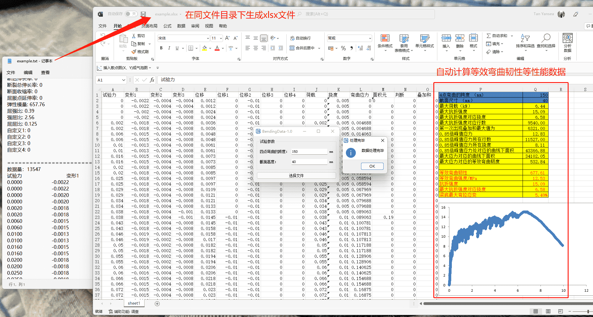

# 混凝土弯曲试验数据处理软件

A concrete bending test data processing software



## 环境

- [Qt 5.9.9](https://download.qt.io/archive/qt/5.9/5.9.9/)
- [QtXlsxWriter](https://github.com/dbzhang800/QtXlsxWriter)

## 需求

日常将混凝土弯曲试验的结果数据（*.txt）处理为性能指标展现在 Excel 中需要人手动操作，首先删除冗余数据然后再将有效数据套用在模板 Excel 文件中，整体步骤有些费事费力，所以有想法将这些步骤由一个软件来完成。软件具体需要实现如下功能：

- 可以手动选择文件目录而不需要将原文件复制到软件同目录下；
- 生成新 *.xlsx 文件到原文件同目录下，且命名与原文件保持一致；
- 可以自定义试验参数（如四点弯曲跨度、试件截面高度等）；
- 处理完成后进行弹窗提示。

## 日志

*221109-v1.1*

```
最大数据处理行数从 15000 行增加到 50000 行；
增加程序处理状态提示；
优化表格结构，提升数据读写效率；
解决关闭文件选择对话框后程序仍会进行无效数据处理的 bug；
解决其他若干小 bug；
规范代码书写，增强可读性。
```

*220331-v1.0*

```
实现软件基本功能；
在 Qt 中引入`QtXlsx`库，实现对 *.xlsx 文件的创建和修改等操作；
通过文件对话框`QFileDialog`实现对原文件路径`filePath`的读取；
通过`QString::replace()`将`filePath`修改为`outputPath`实现新 *.xlsx 文件创建到原文件同目录下，且命名与原文件保持一致的功能；
通过`QLineEdit::editingFinished`信号触发修改试验参数的函数`updateParam`，实现自定义试验参数的功能；
通过`QMessageBox::information()`提示数据处理已完毕。
```

## 下载

- [BendingData](https://pan.baidu.com/s/1lgK7LJbAgPyqKb85xdqhsg?pwd=0000)